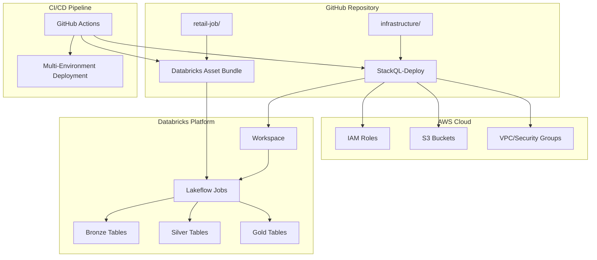

# Databricks Lakeflow Jobs with StackQL-Deploy

A complete end-to-end demonstration of deploying and managing **Databricks Lakeflow jobs** using **StackQL-Deploy** for infrastructure provisioning and **Databricks Asset Bundles (DABs)** for data pipeline management.

[](https://github.com/stackql/databricks-lakeflow-jobs-example/actions/workflows/databricks-dab.yml)

## 🎯 Project Overview

This repository demonstrates modern DataOps practices by combining:

- **🏗️ Infrastructure as Code**: Using [StackQL](https://stackql.io) and [stackql-deploy](https://stackql-deploy.io) for SQL-based infrastructure management
- **📊 Data Pipeline Management**: Using [Databricks Asset Bundles](https://docs.databricks.com/en/dev-tools/bundles/index.html) for job orchestration and deployment
- **🚀 GitOps CI/CD**: Automated infrastructure provisioning and data pipeline deployment via GitHub Actions

### What This Project Does

1. **Provisions Databricks Infrastructure** using StackQL-Deploy:
   - AWS IAM roles and cross-account permissions
   - S3 buckets for workspace storage
   - Databricks workspace with Unity Catalog
   - Storage credentials and external locations

2. **Deploys a Retail Data Pipeline** using Databricks Asset Bundles:
   - Multi-stage data processing (Bronze → Silver → Gold)
   - Parallel task execution with dependency management
   - State-based conditional processing
   - For-each loops for parallel state processing

3. **Automates Everything** with GitHub Actions:
   - Infrastructure provisioning on push to main
   - DAB validation and deployment
   - Multi-environment support (dev/prod)

## 🏛️ Architecture



## 📁 Repository Structure

```
databricks-lakeflow-jobs-example/
├── infrastructure/                    # StackQL infrastructure templates
│   ├── README.md                     # Infrastructure setup guide
│   ├── stackql_manifest.yml         # StackQL deployment configuration
│   └── resources/                    # Cloud resource templates
│       ├── aws/                      # AWS resources (IAM, S3)
│       ├── databricks_account/       # Account-level Databricks resources
│       └── databricks_workspace/     # Workspace configurations
├── retail-job/                       # Databricks Asset Bundle
│   ├── databricks.yml               # DAB configuration
│   └── Task Files/                   # Data pipeline notebooks
│       ├── 01_data_ingestion/        # Bronze layer data ingestion
│       ├── 02_data_loading/          # Customer data loading
│       ├── 03_data_processing/       # Silver layer transformations
│       ├── 04_data_transformation/   # Gold layer clean data
│       └── 05_state_processing/      # State-specific processing
└── .github/workflows/                # CI/CD automation
    └── databricks-dab.yml           # GitHub Actions workflow
```

## 🚀 Quick Start

### Prerequisites

- AWS account with administrative permissions
- Databricks account (see [infrastructure setup guide](./infrastructure/README.md))
- Python 3.8+ and Git

### 1. Clone Repository

```bash
git clone https://github.com/stackql/databricks-lakeflow-jobs-example.git
cd databricks-lakeflow-jobs-example
```

### 2. Set Up Infrastructure

Follow the comprehensive [Infrastructure Setup Guide](./infrastructure/README.md) to:
- Configure AWS and Databricks accounts
- Set up service principals and permissions
- Deploy infrastructure using StackQL-Deploy

### 3. Deploy Data Pipeline

Once infrastructure is provisioned:

```bash
cd retail-job

# Validate the bundle
databricks bundle validate --target dev

# Deploy the data pipeline
databricks bundle deploy --target dev

# Run the complete pipeline
databricks bundle run retail_data_processing_job --target dev
```

## 📊 Data Pipeline Deep Dive

The retail data pipeline demonstrates a complete **medallion architecture** (Bronze → Silver → Gold):

### Pipeline Stages

1. **🥉 Bronze Layer - Data Ingestion**
   - **Orders Ingestion**: Loads raw sales orders data
   - **Sales Ingestion**: Loads raw sales transaction data
   - Tables: `orders_bronze`, `sales_bronze`

2. **🥈 Silver Layer - Data Processing**
   - **Customer Loading**: Loads customer master data
   - **Data Joining**: Joins customers with sales and orders
   - **Duplicate Removal**: Conditional deduplication based on data quality
   - Tables: `customers_bronze`, `customer_sales_silver`, `customer_orders_silver`

3. **🥇 Gold Layer - Data Transformation**
   - **Clean & Transform**: Business-ready, curated datasets
   - **State Processing**: Parallel processing for each US state using for-each loops
   - Tables: `retail_gold`, `state_summary_gold`

### Advanced DAB Features Demonstrated

- **🔄 Parallel Execution**: Multiple tasks run concurrently where dependencies allow
- **🎯 Conditional Tasks**: Deduplication only runs if duplicates are detected
- **🔁 For-Each Loops**: State processing runs in parallel for multiple states
- **📧 Notifications**: Email alerts on job success/failure
- **⏱️ Timeouts & Limits**: Job execution controls and concurrent run limits
- **🎛️ Parameters**: Dynamic state-based processing with base parameters

## 🔄 CI/CD Pipeline

The GitHub Actions workflow ([`.github/workflows/databricks-dab.yml`](./.github/workflows/databricks-dab.yml)) provides complete automation:

### Workflow Triggers

- **Pull Requests**: Validates changes against dev environment
- **Main Branch Push**: Deploys to production environment
- **Path-Based**: Only triggers on infrastructure or job configuration changes

### Deployment Steps

1. **🏗️ Infrastructure Provisioning**
   ```yaml
   - name: Deploy Infrastructure with StackQL
     uses: stackql/stackql-deploy-action@v1.0.2
     with:
       command: 'build'
       stack_dir: 'infrastructure'
       stack_env: ${{ env.ENVIRONMENT }}
   ```

2. **📊 Workspace Configuration**
   - Extracts workspace details from StackQL deployment
   - Configures Databricks CLI with workspace credentials
   - Sets up environment-specific configurations

3. **✅ DAB Validation & Deployment**
   ```yaml
   - name: Validate Databricks Asset Bundle
     run: databricks bundle validate --target ${{ env.ENVIRONMENT }}
   
   - name: Deploy Databricks Jobs
     run: databricks bundle deploy --target ${{ env.ENVIRONMENT }}
   ```

4. **🧪 Pipeline Testing**
   - Runs the complete data pipeline
   - Validates job execution and data quality
   - Reports results and generates summaries

### Environment Management

The workflow supports multiple environments with automatic detection:
- **Dev Environment**: For pull requests and feature development
- **Production Environment**: For main branch deployments

Environment-specific configurations are managed through:
- StackQL environment variables and stack environments
- Databricks Asset Bundle targets (`dev`, `prd`)
- GitHub repository secrets for credentials

## 🛠️ Key Technologies

### StackQL & stackql-deploy
- **SQL-based Infrastructure**: Manage cloud resources using familiar SQL syntax
- **State-free Operations**: No state files - query infrastructure directly from APIs
- **Multi-cloud Support**: Consistent interface across AWS, Azure, GCP, and SaaS providers
- **GitOps Ready**: Native CI/CD integration with GitHub Actions

### Databricks Asset Bundles
- **Environment Consistency**: Deploy the same code across dev/staging/prod
- **Version Control**: Infrastructure and code in sync with Git workflows
- **Advanced Orchestration**: Complex dependencies, conditions, and parallel execution
- **Resource Management**: Automated cluster provisioning and job scheduling

### Modern DataOps Practices
- **Infrastructure as Code**: Everything versioned and reproducible
- **GitOps Workflows**: Pull request-based infrastructure changes
- **Environment Parity**: Identical configurations across environments
- **Automated Testing**: Pipeline validation and data quality checks

## 📚 Learn More

- **[Infrastructure Setup Guide](./infrastructure/README.md)**: Complete StackQL-Deploy setup and usage
- **[StackQL Documentation](https://stackql.io/docs)**: Learn SQL-based infrastructure management
- **[Databricks Asset Bundles](https://docs.databricks.com/en/dev-tools/bundles/)**: DAB concepts and advanced patterns
- **[stackql-deploy GitHub Action](https://github.com/stackql/stackql-deploy-action)**: CI/CD integration guide

## 🤝 Contributing

1. Fork the repository
2. Create a feature branch (`git checkout -b feature/amazing-feature`)
3. Commit your changes (`git commit -m 'Add amazing feature'`)
4. Push to the branch (`git push origin feature/amazing-feature`)
5. Open a Pull Request

## 📄 License

This project is licensed under the MIT License - see the [LICENSE](LICENSE) file for details.

## ⚠️ Important Notes

- **Cost Management**: This project provisions billable cloud resources. Always run teardown commands after testing.
- **Cleanup Required**: Cancel Databricks subscription after completing the exercise to avoid ongoing charges.
- **Security**: Never commit credentials to version control. Use environment variables and CI/CD secrets.

---

*Demonstrating the future of DataOps with SQL-based infrastructure management and modern data pipeline orchestration.*