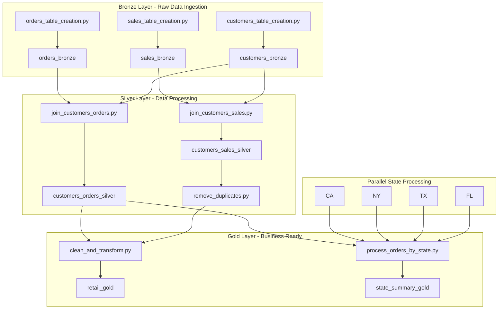

# Retail Data Pipeline - Databricks Asset Bundle

This directory contains a **Databricks Asset Bundle (DAB)** that demonstrates a complete retail data processing pipeline using the **medallion architecture** (Bronze → Silver → Gold). The pipeline showcases advanced DAB features including parallel execution, conditional tasks, for-each loops, and multi-environment deployment.

## 🎯 Pipeline Overview

The retail data pipeline processes customer, sales, and order data through multiple stages to create business-ready datasets for analytics and reporting.

### Data Flow Architecture



## 📊 Pipeline Stages

### 🥉 Bronze Layer - Data Ingestion

Raw data ingestion from source systems into bronze tables.

| Task | Notebook | Output Table | Description |
|------|----------|--------------|-------------|
| `ingest_orders_task` | `01_data_ingestion/orders_table_creation.py` | `orders_bronze` | Loads raw sales orders data |
| `ingest_sales_task` | `01_data_ingestion/sales_table_creation.py` | `sales_bronze` | Loads raw sales transaction data |
| `load_customers_task` | `02_data_loading/customers_table_creation.py` | `customers_bronze` | Loads customer master data |

**Dependencies**: Orders and sales ingestion run in parallel, customers loading waits for both to complete.

### 🥈 Silver Layer - Data Processing

Data joining, cleaning, and quality processing.

| Task | Notebook | Output Table | Description |
|------|----------|--------------|-------------|
| `join_customers_sales_task` | `03_data_processing/join_customers_sales.py` | `customers_sales_silver` | Joins customer and sales data |
| `join_customers_orders_task` | `03_data_processing/join_customers_orders.py` | `customers_orders_silver` | Joins customer and order data |
| `remove_duplicates_task` | `03_data_processing/remove_duplicates.py` | `customers_sales_silver_clean` | **Conditional**: Removes duplicates only if detected |

**Advanced Features**:
- **Parallel Execution**: Customer-sales and customer-orders joins run simultaneously
- **Conditional Processing**: Duplicate removal only executes if `has_duplicates == true`

### 🥇 Gold Layer - Business Ready Data

Final transformations and business-ready datasets.

| Task | Notebook | Output Table | Description |
|------|----------|--------------|-------------|
| `transform_data_task` | `04_data_transformation/clean_and_transform.py` | `retail_gold` | Creates clean, business-ready dataset |
| `process_state_data_task` | `05_state_processing/process_orders_by_state.py` | `state_summary_gold` | **For-Each**: Processes data by US state |

**Advanced Features**:
- **For-Each Loops**: State processing runs in parallel for `["CA", "NY", "TX", "FL"]`
- **Parameterized Execution**: Each state task receives a `state` parameter
- **Outcome-Based Dependencies**: Transform task depends on successful duplicate removal

## 🛠️ Databricks Asset Bundle Configuration

### Bundle Structure

```yaml
bundle:
  name: retail-data-pipeline

targets:
  dev:
    mode: development
    default: true
  prd:
    mode: production
```

### Job Configuration Highlights

```yaml
resources:
  jobs:
    retail_data_processing_job:
      name: "Retail Data Processing Pipeline"
      job_clusters:
        - job_cluster_key: "main_cluster"
          new_cluster:
            spark_version: "13.3.x-scala2.12"
            node_type_id: "i3.xlarge"
            num_workers: 2
      
      # Advanced task orchestration
      tasks:
        - task_key: "remove_duplicates_task"
          condition_task:
            op: "EQUAL_TO"
            left: "{{tasks.join_customers_sales_task.values.has_duplicates}}"
            right: "true"
        
        - task_key: "process_state_data_task"
          for_each_task:
            inputs: '["CA", "NY", "TX", "FL"]'
            task:
              base_parameters:
                state: "{{item}}"
```

### Key DAB Features Demonstrated

1. **🔄 Parallel Task Execution**
   - Multiple tasks run concurrently where dependencies allow
   - Optimizes pipeline execution time

2. **🎯 Conditional Task Execution**
   - Tasks only run when specific conditions are met
   - Reduces unnecessary processing and costs

3. **🔁 For-Each Task Loops**
   - Single task definition processes multiple items in parallel
   - Scalable pattern for similar processing across different parameters

4. **📧 Email Notifications**
   - Automated alerts on job success/failure
   - Configurable notification preferences

5. **⏱️ Execution Controls**
   - Job timeouts and concurrent run limits
   - Resource management and cost control

6. **🎛️ Dynamic Parameters**
   - Base parameters passed to notebook tasks
   - Environment-specific configurations

## 🚀 Deployment and Usage

### Prerequisites

- Databricks workspace provisioned (see [infrastructure README](../infrastructure/README.md))
- Databricks CLI installed and configured
- Appropriate permissions for job creation and execution

### Local Development

```bash
# Navigate to the retail-job directory
cd retail-job

# Validate the bundle configuration
databricks bundle validate --target dev

# Deploy to development environment
databricks bundle deploy --target dev

# Run the complete pipeline
databricks bundle run retail_data_processing_job --target dev

# Monitor job execution
databricks jobs get-run <run-id> --target dev
```

### Environment-Specific Deployment

#### Development Environment
```bash
# Deploy to dev workspace
databricks bundle deploy --target dev

# Uses development mode settings:
# - Smaller cluster configurations
# - Personal workspace paths
# - Development-specific permissions
```

#### Production Environment
```bash
# Deploy to production workspace
databricks bundle deploy --target prd

# Uses production mode settings:
# - Production-grade cluster configurations
# - Shared workspace paths
# - Production access controls
```

### Pipeline Monitoring

After deployment, monitor your pipeline:

1. **Databricks UI**: Navigate to Workflows → Jobs → "Retail Data Processing Pipeline"
2. **CLI Monitoring**: Use `databricks jobs list` and `databricks jobs get-run`
3. **Email Notifications**: Configured for job success/failure alerts

## 📁 Directory Structure

```
retail-job/
├── README.md                          # This file
├── databricks.yml                     # DAB configuration
└── Task Files/                        # Pipeline notebooks
    ├── 01_data_ingestion/             # Bronze layer data ingestion
    │   ├── orders_table_creation.py
    │   └── sales_table_creation.py
    ├── 02_data_loading/               # Customer data loading
    │   └── customers_table_creation.py
    ├── 03_data_processing/            # Silver layer processing
    │   ├── join_customers_orders.py
    │   ├── join_customers_sales.py
    │   └── remove_duplicates.py
    ├── 04_data_transformation/        # Gold layer transformations
    │   └── clean_and_transform.py
    └── 05_state_processing/           # State-specific processing
        └── process_orders_by_state.py
```

## 🧪 Testing and Validation

### Data Quality Checks

The pipeline includes built-in data quality validations:

1. **Duplicate Detection**: Automatically identifies and flags duplicate records
2. **Conditional Processing**: Only processes data when quality thresholds are met
3. **State Validation**: Ensures state-specific processing handles all target states

### Manual Testing

```bash
# Test individual notebooks
databricks workspace download "./Task Files/01_data_ingestion/orders_table_creation.py"

# Validate specific task execution
databricks jobs run-now --job-id <job-id> --notebook-params state=CA
```

## 🔧 Customization

### Adding New States

To process additional states, update the `databricks.yml`:

```yaml
- task_key: "process_state_data_task"
  for_each_task:
    inputs: '["CA", "NY", "TX", "FL", "WA", "OR"]'  # Add new states here
```

### Modifying Cluster Configuration

Adjust cluster settings based on your workload:

```yaml
job_clusters:
  - job_cluster_key: "main_cluster"
    new_cluster:
      spark_version: "13.3.x-scala2.12"
      node_type_id: "i3.2xlarge"    # Scale up for larger datasets
      num_workers: 5                # Increase workers for parallel processing
```

### Environment-Specific Settings

Customize behavior per environment in the targets section:

```yaml
targets:
  dev:
    mode: development
    variables:
      cluster_size: "small"
      notification_email: "dev-team@company.com"
  
  prd:
    mode: production
    variables:
      cluster_size: "large"
      notification_email: "data-ops@company.com"
```

## 🔗 Integration with CI/CD

This DAB integrates with the repository's GitHub Actions workflow ([`../.github/workflows/databricks-dab.yml`](../.github/workflows/databricks-dab.yml)):

1. **Automatic Validation**: Every pull request validates the bundle
2. **Environment Deployment**: Pushes to main deploy to production
3. **Infrastructure Coordination**: Waits for infrastructure provisioning before deploying jobs

## 📚 Learn More

- **[Databricks Asset Bundles Documentation](https://docs.databricks.com/en/dev-tools/bundles/)**: Complete DAB reference
- **[Workflow Orchestration](https://docs.databricks.com/en/workflows/)**: Advanced job orchestration patterns
- **[Delta Lake Best Practices](https://docs.databricks.com/en/delta/)**: Optimizing data pipeline performance
- **[Repository Main README](../README.md)**: Complete project overview and setup

## 🎯 Next Steps

1. **Explore the Notebooks**: Review each task file to understand the data transformations
2. **Customize the Pipeline**: Modify tasks and dependencies for your use case
3. **Add Data Quality**: Implement additional validation and monitoring
4. **Scale the Processing**: Adjust cluster configurations for your data volume
5. **Extend Functionality**: Add new stages or integrate with external systems

---

*This DAB demonstrates modern data pipeline development using Databricks Asset Bundles with advanced orchestration features.*